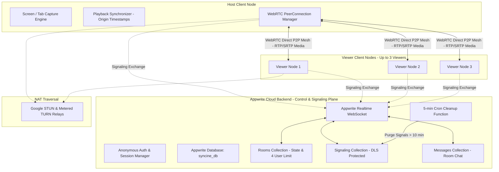
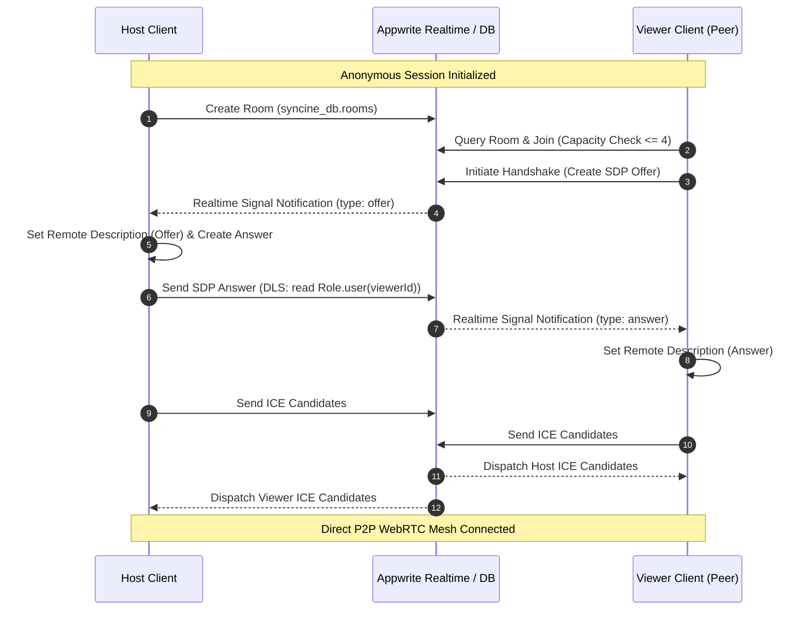
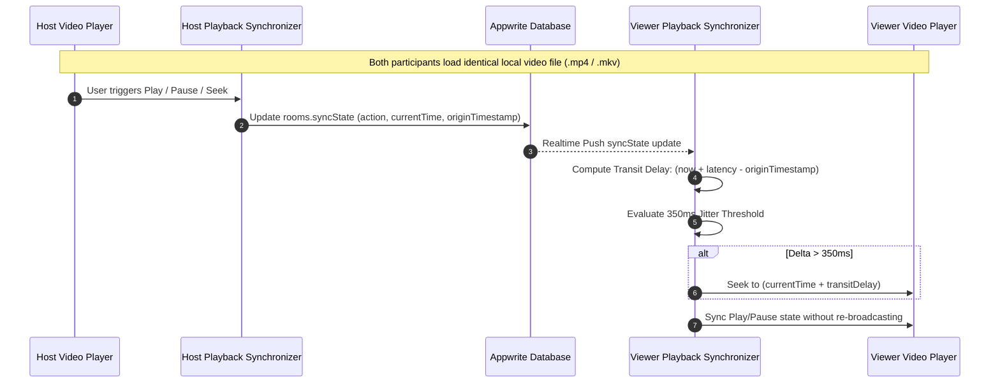
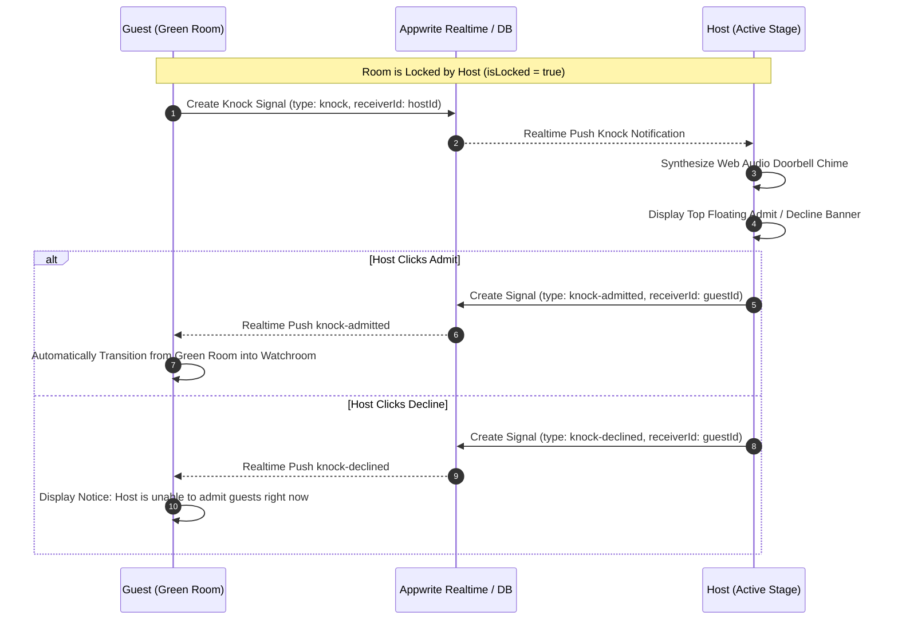

# SynCine

[](LICENSE)
[](https://www.typescriptlang.org/)
[](https://vitejs.dev/)
[](https://appwrite.io/)
[](https://tailwindcss.com/)

SynCine is a zero-cost, cross-browser collaborative streaming and synchronized movie-watching web application built on WebRTC and Appwrite Cloud.

It decouples the Control and Signaling Plane from the Media Transport Plane, eliminating expensive media servers and streaming video directly via client-side WebRTC mesh or distributed local file synchronization.

---

## System Architecture



---

## WebRTC Signaling Handshake Flow



---

## Drift-Compensated Playback Sync (Local File Mode)



---

## Locked Room Doorbell & Knocking Protocol



---

## Core Capabilities

### 1. Tri-Mode Cinema Streaming
- **Screen / Tab Sharing:** The host captures a tab or application window with `getDisplayMedia`. Audio and video tracks prioritize software-safe VP8 encoding with graceful H.264 and VP9 fallbacks over direct WebRTC peer connections. Presenter audio is muted locally to prevent acoustic feedback loops and double audio echo.
- **Local File Sync:** Zero upload bandwidth mode where participants drop identical local video files into their browsers (`URL.createObjectURL(file)`). Playback state (play, pause, seek) synchronizes with round-trip latency compensation.
- **YouTube Cinema Sync:** Zero bandwidth streaming directly from YouTube CDN in 4K and 1080p. The host controls playback and seeking while all guests remain synchronized with drift compensation.

### 2. Cinema Audio & Visual Enhancements
- **Dynamic Cinema Ambilight:** GPU-accelerated canvas ambient lighting that samples real-time edge colors at 32x18 resolution and diffuses a soft reactive backlight glow behind the cinema player.
- **Speech Clarity EQ (Dialogue Booster):** Web Audio peaking equalizer filter calibrated at 2.5 kHz (+3.5 dB or +6.0 dB) to elevate human speech frequencies over intense background scores.
- **Night Mode Dynamics Compression:** Dynamics compressor node that automatically tames sudden explosive sound effects while gently lifting whisper dialogues for late-night listening.
- **Background Blur & Bokeh:** Client-side camera segmentation with portrait bokeh blur presets (Subtle, Portrait, Deep) and fine-grained radius control accessible right from the video tile hover menu or settings.
- **Picture-in-Picture (PiP):** Floating multitasking video window with instant toggle hotkey (`Shift+P`).

### 3. Participant Limits & Security
- **Strict Capacity:** Limited to a maximum of 4 participants per room to guarantee low P2P mesh CPU and bandwidth overhead.
- **Host Room Locking & Doorbell:** Hosts can lock the room. Guests in the Green Room knock to request admission, triggering a synthesized doorbell chime on the host's screen.
- **Document-Level Security (DLS):** Ephemeral WebRTC signaling documents (`signaling`) are restricted so only the intended recipient can read the SDP payloads.
- **Automated Ephemeral Cleanup:** An Appwrite serverless function executes on a 5-minute cron schedule (`*/5 * * * *`) to purge signaling documents older than 10 minutes.

### 4. DRM Streaming & Hardware Acceleration Architecture
- **Widevine L1 vs L3 Explained:** Streaming platforms like Disney+ Hotstar, Netflix, and Prime Video negotiate Widevine L1 DRM when GPU hardware acceleration is active. The video is decoded directly in the graphics card hardware enclave, and the operating system places a hardware protection lock on the window (`WDA_MONITOR`), turning captured frames pure black. Turning off hardware acceleration for the player forces Widevine into L3 software memory decryption, allowing clean video capture without black screens.
- **Method 1: Dual-Browser Setup (Recommended for 120fps GPU Performance):**
  - Run the video source (Netflix, Hotstar, Prime) in a secondary browser window or separate browser profile (e.g. Firefox, Edge, or a secondary Chrome profile) with Hardware Acceleration **OFF**.
  - Run SynCine in your primary browser with Hardware Acceleration **ON**.
  - Share that movie tab in SynCine: the video captures with zero black screen, while SynCine retains full 120fps GPU performance, smooth UI, and reactive Ambilight glow.
- **Method 2: Global Browser Toggle:** Turn off Hardware Acceleration in browser settings (`chrome://settings/system`) and relaunch. SynCine's automated software-rendering optimizer will automatically adapt.
- **Chrome Tab vs Window Capture:** Always select **Chrome Tab** when sharing streaming media. Tab capture uses direct Chromium internal compositor frame readback with native tab audio loopback and zero OS window minimization issues. Window capture relies on the operating system window manager, which is vulnerable to DPI scaling mismatches, odd-pixel macroblock stride drops, and background window pauses.

### 5. Keyboard Shortcuts
- `M`: Mute / Unmute Microphone
- `Space`: Push-to-Talk (Hold to speak, release to mute)
- `O`: Camera On / Off
- `\`: Camera Mirror Mode On / Off
- `F`: Toggle Full Screen
- `Esc`: Exit Full Screen / Close Active Modals
- `Shift+P`: Picture-in-Picture Floating Window
- `A`: Toggle Dynamic Ambilight Glow
- `P`: Pin / Unpin Focused Video Feed
- `S`: Settings Menu & Pipeline Diagnostics
- `R`: Cinema Emoji Reactions Tray
- `C`: Toggle Room Chat Sidebar
- `H`: Host Controls Panel (Host Only)
- `I`: Copy Clean Watchroom Invite Link (`/e89-ag8-zm5`)
- `?`: Open Keyboard Shortcuts Cheatsheet

---

## Project Structure

```
SynCine/
├── .agents/skills/                   # Appwrite agent skills
├── .cursor/rules/appwrite.mdc        # Appwrite architectural rules
├── .github/workflows/deploy.yml      # CI/CD deployment workflow
├── functions/
│   └── cleanup-stale-signals/        # Appwrite serverless cleanup cron function
│       ├── package.json
│       └── src/main.js
├── scripts/
│   └── setup-appwrite.ts             # Appwrite database provisioning script
├── src/
│   ├── components/
│   │   ├── icons/
│   │   │   └── SynIcons.tsx          # Handcrafted Greek Sigma & cinema SVG icons
│   │   ├── ChatSidebar.tsx           # Real-time room text chat drawer
│   │   ├── DraggableTile.tsx         # Floating draggable participant video
│   │   ├── LiquidGlassCard.tsx       # Reusable Apple VisionOS glassmorphic card
│   │   ├── LiquidGlassFilters.tsx    # Procedural feTurbulence & feDisplacementMap filters
│   │   ├── Lobby.tsx                 # Watchroom creation, joining & guest auth
│   │   ├── RoomView.tsx              # Room container & WebRTC coordinator
│   │   ├── ShaderCanvas.tsx          # 60fps WebGL fluid gradient canvas
│   │   └── WatchStage.tsx            # Theater, Grid & Floating viewport stage
│   ├── lib/
│   │   ├── appwrite.ts               # Appwrite client singleton & types
│   │   ├── media-capture.ts          # Screen & mic capture with Safari guards
│   │   ├── sync-engine.ts            # Drift-compensated playback synchronizer
│   │   └── webrtc.ts                 # P2P WebRTC mesh engine
│   ├── App.tsx                       # Main application router
│   ├── index.css                     # Dark cinematic styling & custom scrollbars
│   ├── main.tsx                      # Application entrypoint
│   └── vite-env.d.ts                 # Vite environment definitions
├── tests/
│   ├── capture.test.ts               # Media capture unit tests
│   ├── setup.ts                      # Test setup configuration
│   ├── sync.test.ts                  # Synchronization & jitter unit tests
│   └── webrtc.test.ts                # WebRTC engine unit tests
├── index.html
├── package.json
├── tailwind.config.js
├── tsconfig.json
├── vite.config.ts
└── vitest.config.ts
```

---

## Environment Configuration

Create a `.env` file in the project root:

```ini
# Client Variables (Exposed to Vite bundle)
VITE_APPWRITE_ENDPOINT=https://sgp.cloud.appwrite.io/v1
VITE_APPWRITE_PROJECT_ID=6a97c0ed000188adaed0
VITE_APPWRITE_DATABASE_ID=syncine_db
VITE_MAX_PARTICIPANTS=4

# Server Provisioning & Function Execution (Private)
APPWRITE_ENDPOINT=https://sgp.cloud.appwrite.io/v1
APPWRITE_PROJECT_ID=6a97c0ed000188adaed0
APPWRITE_DATABASE_ID=syncine_db
APPWRITE_API_KEY=your_appwrite_admin_api_key
```

---

## Getting Started

### 1. Install Dependencies
```bash
npm install
```

### 2. Provision Appwrite Backend
```bash
npm run setup:appwrite
```

### 3. Run Development Server
```bash
npm run dev
```

### 4. Run Test Suite
```bash
npm test
```

### 5. Build for Production
```bash
npm run build
```

---

## Production Verification Runbook

1. **Anonymous Authentication:** Navigating to the application URL creates an anonymous session instantly without authentication screens.
2. **Safari Compatibility:** The host interface detects Safari and falls back to Local File Sync mode without crashing `getDisplayMedia`.
3. **DRM Protected Media:** Streaming Netflix/Prime/Hotstar functions without black screens when hardware acceleration is disabled in the source player. For optimal responsiveness, keep hardware acceleration enabled in the SynCine window and isolate DRM streaming in a secondary browser profile.
4. **Touch-Action Isolation:** Dragging floating video boxes on iPadOS Safari or touch displays repositions tiles smoothly without scrolling or zooming the webpage.
5. **Ephemeral Cleanup:** The Appwrite cron function purges signaling documents older than 10 minutes to respect database quotas.
