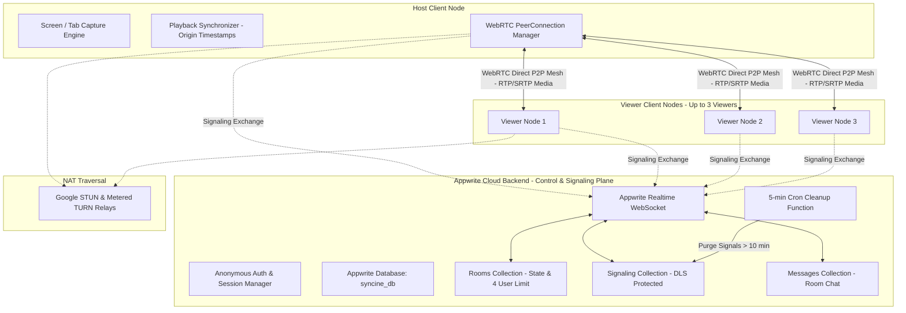
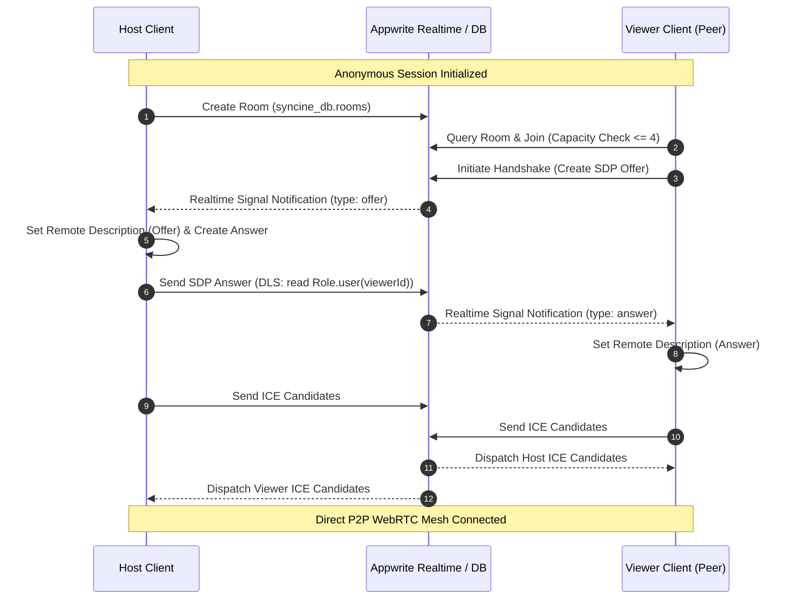
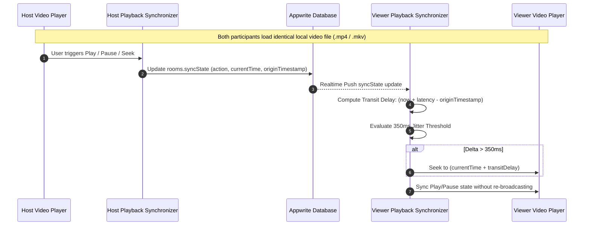

# SynCine

[](LICENSE)
[](https://www.typescriptlang.org/)
[](https://vitejs.dev/)
[](https://appwrite.io/)
[](https://tailwindcss.com/)

SynCine is a zero-cost, cross-browser collaborative streaming and synchronized movie-watching web application built on WebRTC and Appwrite Cloud.

It decouples the Control and Signaling Plane from the Media Transport Plane, eliminating expensive media servers and streaming video directly via client-side WebRTC mesh or distributed local file synchronization.

---

## System Architecture



---

## WebRTC Signaling Handshake Flow



---

## Drift-Compensated Playback Sync (Local File Mode)



---

## Core Capabilities

### 1. Dual Playback Modes
- **Screen / Tab Sharing:** The host captures a tab or application window with `getDisplayMedia`. Audio and video tracks are negotiated via H.264 over direct WebRTC peer connections.
- **Local File Sync:** Zero upload bandwidth mode where participants drop identical local video files into their browsers (`URL.createObjectURL(file)`). Playback state (play, pause, seek) synchronizes with round-trip latency compensation.

### 2. Participant Limits & Security
- **Strict Capacity:** Limited to a maximum of 4 participants per room to guarantee low P2P mesh CPU and bandwidth overhead.
- **Document-Level Security (DLS):** Ephemeral WebRTC signaling documents (`signaling`) are restricted so only the intended recipient can read the SDP payloads.
- **Automated Ephemeral Cleanup:** An Appwrite serverless function executes on a 5-minute cron schedule (`*/5 * * * *`) to purge signaling documents older than 10 minutes.

### 3. Cross-Browser Optimization
- **Safari Audio Guard:** Detects WebKit/Safari user agents and omits audio constraints on `getDisplayMedia` to prevent fatal `DOMException` errors.
- **H.264 Codec Priority:** WebRTC transceivers set codec preferences prioritizing `video/h264` for macOS and iOS hardware decoding.
- **Pointer-Safe Floating Viewport:** Drag participant video tiles freely across the stage with pointer capture (`setPointerCapture`) and `touchAction: none` to isolate dragging from page scroll or zoom.

---

## Project Structure

```
SynCine/
├── .agents/skills/                   # Appwrite agent skills
├── .cursor/rules/appwrite.mdc        # Appwrite architectural rules
├── .github/workflows/deploy.yml      # CI/CD deployment workflow
├── functions/
│   └── cleanup-stale-signals/        # Appwrite serverless cleanup cron function
│       ├── package.json
│       └── src/main.js
├── scripts/
│   └── setup-appwrite.ts             # Appwrite database provisioning script
├── src/
│   ├── components/
│   │   ├── icons/
│   │   │   └── SynIcons.tsx          # Handcrafted Greek Sigma & cinema SVG icons
│   │   ├── ChatSidebar.tsx           # Real-time room text chat drawer
│   │   ├── DraggableTile.tsx         # Floating draggable participant video
│   │   ├── LiquidGlassCard.tsx       # Reusable Apple VisionOS glassmorphic card
│   │   ├── LiquidGlassFilters.tsx    # Procedural feTurbulence & feDisplacementMap filters
│   │   ├── Lobby.tsx                 # Watchroom creation, joining & guest auth
│   │   ├── RoomView.tsx              # Room container & WebRTC coordinator
│   │   ├── ShaderCanvas.tsx          # 60fps WebGL fluid gradient canvas
│   │   └── WatchStage.tsx            # Theater, Grid & Floating viewport stage
│   ├── lib/
│   │   ├── appwrite.ts               # Appwrite client singleton & types
│   │   ├── media-capture.ts          # Screen & mic capture with Safari guards
│   │   ├── sync-engine.ts            # Drift-compensated playback synchronizer
│   │   └── webrtc.ts                 # P2P WebRTC mesh engine
│   ├── App.tsx                       # Main application router
│   ├── index.css                     # Dark cinematic styling & custom scrollbars
│   ├── main.tsx                      # Application entrypoint
│   └── vite-env.d.ts                 # Vite environment definitions
├── tests/
│   ├── capture.test.ts               # Media capture unit tests
│   ├── setup.ts                      # Test setup configuration
│   ├── sync.test.ts                  # Synchronization & jitter unit tests
│   └── webrtc.test.ts                # WebRTC engine unit tests
├── index.html
├── package.json
├── tailwind.config.js
├── tsconfig.json
├── vite.config.ts
└── vitest.config.ts
```

---

## Environment Configuration

Create a `.env` file in the project root:

```ini
# Client Variables (Exposed to Vite bundle)
VITE_APPWRITE_ENDPOINT=https://sgp.cloud.appwrite.io/v1
VITE_APPWRITE_PROJECT_ID=6a97c0ed000188adaed0
VITE_APPWRITE_DATABASE_ID=syncine_db
VITE_MAX_PARTICIPANTS=4

# Server Provisioning & Function Execution (Private)
APPWRITE_ENDPOINT=https://sgp.cloud.appwrite.io/v1
APPWRITE_PROJECT_ID=6a97c0ed000188adaed0
APPWRITE_DATABASE_ID=syncine_db
APPWRITE_API_KEY=your_appwrite_admin_api_key
```

---

## Getting Started

### 1. Install Dependencies
```bash
npm install
```

### 2. Provision Appwrite Backend
```bash
npm run setup:appwrite
```

### 3. Run Development Server
```bash
npm run dev
```

### 4. Run Test Suite
```bash
npm test
```

### 5. Build for Production
```bash
npm run build
```

---

## Production Verification Runbook

1. **Anonymous Authentication:** Navigating to the application URL creates an anonymous session instantly without authentication screens.
2. **Safari Compatibility:** The host interface detects Safari and falls back to Local File Sync mode without crashing `getDisplayMedia`.
3. **DRM Protected Media:** Streaming Netflix/Prime from Chrome or Edge functions without black screens when hardware acceleration is disabled in browser settings.
4. **Touch-Action Isolation:** Dragging floating video boxes on iPadOS Safari or touch displays repositions tiles smoothly without scrolling or zooming the webpage.
5. **Ephemeral Cleanup:** The Appwrite cron function purges signaling documents older than 10 minutes to respect database quotas.
